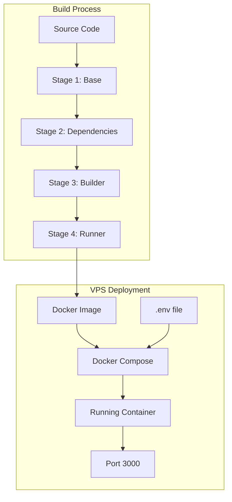

# Design Document

## Overview

This design document outlines the Docker deployment architecture for the Next.js monorepo application. The solution uses a multi-stage Docker build optimized for pnpm workspaces and Turborepo, producing a minimal production image that can be deployed on any VPS with Docker installed.

## Architecture

The deployment architecture consists of:

1. **Multi-stage Dockerfile** - Four stages for optimal build caching and minimal image size
2. **Docker Compose** - Orchestration for easy deployment and management
3. **Environment Configuration** - Flexible configuration through environment variables



## Components and Interfaces

### 1. Dockerfile (Multi-stage Build)

**Stage 1 - Base**: Sets up the base Node.js Alpine image with pnpm enabled via corepack.

**Stage 2 - Dependencies**: Installs all monorepo dependencies using pnpm with frozen lockfile.

**Stage 3 - Builder**: Builds the Next.js application with Turborepo, producing standalone output.

**Stage 4 - Runner**: Minimal production image containing only the standalone build output.

### 2. Docker Compose Configuration

- Service definition for the web application
- Port mapping (host:container)
- Environment variable injection
- Restart policy configuration
- Build context specification

### 3. Next.js Configuration Update

The `next.config.mjs` must be updated to enable standalone output mode:

```javascript
const nextConfig = {
  output: 'standalone',
  transpilePackages: ["@workspace/ui"],
}
```

### 4. Environment Files

- `.env.example` - Template for required environment variables
- `.env` - Actual environment values (gitignored)

## Data Models

### Docker Build Arguments

| Argument | Type | Default | Description |
|----------|------|---------|-------------|
| NODE_VERSION | string | 20 | Node.js version for base image |

### Environment Variables

| Variable | Type | Required | Description |
|----------|------|----------|-------------|
| NODE_ENV | string | Yes | Runtime environment (production) |
| PORT | number | No | Application port (default: 3000) |
| HOSTNAME | string | No | Bind address (default: 0.0.0.0) |

### Docker Compose Configuration

| Setting | Value | Description |
|---------|-------|-------------|
| restart | unless-stopped | Restart policy |
| ports | 3000:3000 | Port mapping |
| env_file | .env | Environment file |

## Correctness Properties

*A property is a characteristic or behavior that should hold true across all valid executions of a system-essentially, a formal statement about what the system should do. Properties serve as the bridge between human-readable specifications and machine-verifiable correctness guarantees.*

Based on the prework analysis, most acceptance criteria are configuration-based examples rather than universal properties. However, one property can be identified:

### Property 1: Environment Variable Passthrough

*For any* environment variable passed to the Docker container at runtime, the Next.js application running inside the container SHALL have access to that environment variable with the same value.

**Validates: Requirements 2.3**

## Error Handling

### Build Errors

| Error | Cause | Resolution |
|-------|-------|------------|
| pnpm install fails | Network issues or lockfile mismatch | Ensure pnpm-lock.yaml is committed and network is available |
| Build fails | TypeScript or build errors | Fix source code errors before building |
| Out of memory | Large build on limited resources | Increase Docker memory limit or use build server |

### Runtime Errors

| Error | Cause | Resolution |
|-------|-------|------------|
| Port already in use | Another service on port 3000 | Change port mapping in docker-compose.yml |
| Container exits immediately | Missing environment variables | Check .env file and required variables |
| Permission denied | File permission issues | Ensure proper ownership in Dockerfile |

## Testing Strategy

### Unit Testing

Not applicable for Docker configuration files. Configuration is validated through integration testing.

### Integration Testing (Examples)

1. **Build Test**: Run `docker build` and verify successful image creation
2. **Container Start Test**: Run container and verify it starts without errors
3. **Port Accessibility Test**: Verify application responds on configured port
4. **Environment Variable Test**: Pass env vars and verify application receives them
5. **Graceful Shutdown Test**: Send SIGTERM and verify clean shutdown

### Property-Based Testing

**Property 1** can be tested by:
- Generating random environment variable names and values
- Passing them to the container
- Verifying the application can read them with identical values

Testing framework: The property test would use a shell script or Node.js test that:
1. Generates random env var key-value pairs
2. Starts container with those variables
3. Executes a command inside container to echo the variable
4. Compares input and output values

Due to the infrastructure nature of this feature, property-based testing is limited. The primary validation is through integration tests that verify the Docker configuration works correctly.
