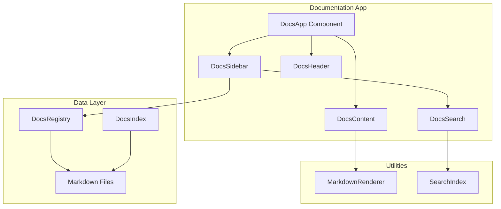

# Design Document: Documentation App

## Overview

The Documentation App is a React-based desktop application within the OS layout that provides a centralized documentation viewer for all apps in the system. It follows the existing app patterns established in the codebase, using a sidebar-main panel layout similar to the Notes and Knowledge Base apps.

The app will read documentation from markdown files stored in a dedicated docs directory, render them with proper formatting, and provide search and navigation capabilities.

## Architecture



## Components and Interfaces

### Main Components

#### DocsApp (index.tsx)
The root component that orchestrates the documentation viewer.

```typescript
interface DocsAppProps {
  // No props needed - self-contained app
}
```

#### DocsSidebar
Displays the list of apps with documentation status indicators.

```typescript
interface DocsSidebarProps {
  apps: AppDocEntry[];
  selectedAppId: string | null;
  onSelectApp: (appId: string) => void;
  searchQuery: string;
  onSearchChange: (query: string) => void;
}

interface AppDocEntry {
  id: string;
  name: string;
  icon: string;
  hasDocumentation: boolean;
  categories: DocCategory[];
}
```

#### DocsContent
Renders the documentation content with markdown support.

```typescript
interface DocsContentProps {
  appId: string | null;
  content: DocContent | null;
  isLoading: boolean;
  error: string | null;
  onNavigate: (direction: 'prev' | 'next') => void;
  canNavigatePrev: boolean;
  canNavigateNext: boolean;
}

interface DocContent {
  title: string;
  markdown: string;
  category: string;
  appId: string;
}
```

#### DocsHeader
Header with app title and actions.

```typescript
interface DocsHeaderProps {
  selectedApp: AppDocEntry | null;
  onSearch: () => void;
}
```

#### DocsTableOfContents
Navigation within documentation categories.

```typescript
interface DocsTableOfContentsProps {
  categories: DocCategory[];
  activeCategory: string | null;
  onSelectCategory: (categoryId: string) => void;
}

interface DocCategory {
  id: string;
  name: string;
  order: number;
  entries: DocEntry[];
}

interface DocEntry {
  id: string;
  title: string;
  slug: string;
}
```

#### DocsSearchResults
Displays search results across all documentation.

```typescript
interface DocsSearchResultsProps {
  results: SearchResult[];
  onSelectResult: (result: SearchResult) => void;
  isSearching: boolean;
}

interface SearchResult {
  appId: string;
  appName: string;
  entryId: string;
  title: string;
  snippet: string;
  category: string;
}
```

#### MarkdownRenderer
Renders markdown content with code block copy functionality.

```typescript
interface MarkdownRendererProps {
  content: string;
  onCopyCode: (code: string) => void;
}
```

### Hooks

#### useDocs
Main hook for documentation state management.

```typescript
interface UseDocsReturn {
  apps: AppDocEntry[];
  selectedAppId: string | null;
  selectedApp: AppDocEntry | null;
  content: DocContent | null;
  isLoading: boolean;
  error: string | null;
  selectApp: (appId: string) => void;
  selectCategory: (categoryId: string) => void;
  selectEntry: (entryId: string) => void;
  navigate: (direction: 'prev' | 'next') => void;
  canNavigatePrev: boolean;
  canNavigateNext: boolean;
}
```

#### useDocsSearch
Hook for search functionality.

```typescript
interface UseDocsSearchReturn {
  query: string;
  setQuery: (query: string) => void;
  results: SearchResult[];
  isSearching: boolean;
  clearSearch: () => void;
}
```

## Data Models

### Documentation Structure

Documentation will be stored in a structured format:

```typescript
// Documentation registry type
interface DocsRegistry {
  apps: Record<string, AppDocumentation>;
}

interface AppDocumentation {
  id: string;
  name: string;
  icon: string;
  description: string;
  categories: DocCategory[];
}

interface DocCategory {
  id: string;
  name: string;
  order: number; // For sorting: 1=Overview, 2=Getting Started, 3=Features, 4=API Reference
  entries: DocEntry[];
}

interface DocEntry {
  id: string;
  title: string;
  slug: string;
  content: string; // Markdown content
}
```

### Category Order Constants

```typescript
const CATEGORY_ORDER = {
  'overview': 1,
  'getting-started': 2,
  'features': 3,
  'api-reference': 4,
  'troubleshooting': 5,
} as const;
```

### Search Index Structure

```typescript
interface SearchIndexEntry {
  appId: string;
  appName: string;
  categoryId: string;
  categoryName: string;
  entryId: string;
  entryTitle: string;
  content: string; // Full text for searching
  tokens: string[]; // Tokenized words for faster search
}
```

## Correctness Properties

*A property is a characteristic or behavior that should hold true across all valid executions of a system-essentially, a formal statement about what the system should do. Properties serve as the bridge between human-readable specifications and machine-verifiable correctness guarantees.*

### Property 1: Sidebar displays all registered apps
*For any* app registry containing N apps, the sidebar component SHALL render exactly N app entries, each with the correct id, name, and icon from the registry.
**Validates: Requirements 1.1**

### Property 2: App selection updates content panel
*For any* app selection from the sidebar, the content panel SHALL display documentation content where the appId matches the selected app's id.
**Validates: Requirements 1.2**

### Property 3: Markdown rendering produces valid HTML structure
*For any* valid markdown input containing headings, code blocks, and links, the rendered output SHALL contain corresponding HTML elements (h1-h6, pre/code, a tags) that preserve the semantic structure.
**Validates: Requirements 1.3**

### Property 4: Search results contain query text
*For any* search query and documentation corpus, all returned search results SHALL contain the query text (case-insensitive) in either the title, content, or category name.
**Validates: Requirements 2.1**

### Property 5: Search results contain required fields
*For any* search result returned by the search function, the result object SHALL contain non-empty values for appName, title, and snippet fields.
**Validates: Requirements 2.2**

### Property 6: Category ordering is consistent
*For any* documentation with multiple categories, the displayed order SHALL follow the predefined order: Overview (1), Getting Started (2), Features (3), API Reference (4), with any additional categories sorted alphabetically after.
**Validates: Requirements 3.3**

### Property 7: Documentation availability indicator accuracy
*For any* app in the sidebar, the hasDocumentation indicator SHALL be true if and only if the app has at least one documentation entry in the registry.
**Validates: Requirements 4.1, 4.2**

### Property 8: Navigation maintains entry sequence
*For any* documentation with N entries, navigating next from entry i (where i < N) SHALL display entry i+1, and navigating previous from entry i (where i > 1) SHALL display entry i-1.
**Validates: Requirements 5.2, 5.3**

### Property 9: Code blocks have copy buttons
*For any* rendered markdown containing M code blocks, the output SHALL contain exactly M copy button elements, each associated with its corresponding code block content.
**Validates: Requirements 7.1**

## Error Handling

### Loading States
- Display skeleton loaders while fetching documentation content
- Show loading spinner during search operations

### Error States
- Display user-friendly error messages when documentation fails to load
- Provide retry button for failed operations
- Log errors to console for debugging

### Edge Cases
- Apps without documentation show placeholder message
- Empty search results show "No results found" message
- Navigation buttons disabled at boundaries

## Testing Strategy

### Dual Testing Approach

The Documentation App will use both unit tests and property-based tests to ensure correctness:

#### Unit Tests
Unit tests will cover:
- Component rendering with various props
- User interaction handlers (click, input)
- Edge cases (empty states, error states)
- Integration between components

#### Property-Based Tests
Property-based tests will use **fast-check** library to verify:
- Sidebar always displays all apps from registry
- Search results always contain query text
- Category ordering is always correct
- Navigation maintains proper sequence
- Markdown rendering produces valid structure

Each property-based test will:
- Run a minimum of 100 iterations
- Be tagged with the corresponding correctness property reference
- Use format: `**Feature: documentation-app, Property {number}: {property_text}**`

### Test File Structure
```
apps/web/layouts/os/apps/docs/
├── __tests__/
│   ├── docs-app.test.tsx          # Component unit tests
│   ├── use-docs.test.ts           # Hook unit tests
│   ├── use-docs-search.test.ts    # Search hook tests
│   ├── docs-app.property.test.ts  # Property-based tests
│   └── test-utils.ts              # Test utilities and generators
```

### Property Test Generators
```typescript
// Example generators for property tests
const appDocEntryArb = fc.record({
  id: fc.string({ minLength: 1 }),
  name: fc.string({ minLength: 1 }),
  icon: fc.string({ minLength: 1 }),
  hasDocumentation: fc.boolean(),
  categories: fc.array(docCategoryArb),
});

const searchQueryArb = fc.string({ minLength: 1, maxLength: 50 });
```

## File Structure

```
apps/web/layouts/os/apps/docs/
├── index.tsx                    # Main DocsApp component
├── types.ts                     # TypeScript interfaces
├── use-docs.ts                  # Main documentation hook
├── use-docs-search.ts           # Search functionality hook
├── docs-registry.ts             # Documentation data registry
├── components/
│   ├── docs-header.tsx          # Header component
│   ├── docs-sidebar.tsx         # Sidebar with app list
│   ├── docs-content.tsx         # Main content area
│   ├── docs-table-of-contents.tsx # TOC navigation
│   ├── docs-search-results.tsx  # Search results display
│   ├── markdown-renderer.tsx    # Markdown rendering
│   └── code-block.tsx           # Code block with copy
└── data/
    └── app-docs/                # Documentation markdown files
        ├── finder.md
        ├── notes.md
        ├── kanban.md
        └── ...
```

