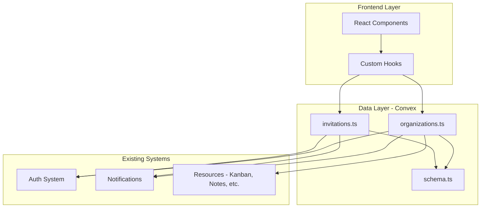

# Design Document: Organization Invite Feature

## Overview

This document describes the design for the Organization feature that enables users to create collaborative workspaces, invite other users, and share resources (Kanban boards, Notes, Chat sessions, Artifacts) with different permission levels. The feature integrates with the existing Convex-based data layer and authentication system.

## Architecture

The Organization feature follows the existing application architecture pattern using Convex for the backend data layer with real-time subscriptions. The feature introduces three new domain entities (Organizations, Memberships, Invitations) and extends existing resource tables with sharing capabilities.



### Design Decisions

1. **Convex as Backend**: Continues the existing pattern of using Convex for real-time data synchronization, which is critical for collaborative features where membership and sharing changes need to propagate immediately.

2. **Separate Membership Table**: Rather than embedding members in the organization document, a separate `organizationMembers` table allows for efficient querying by user (to find all organizations a user belongs to) and by organization (to list all members).

3. **Resource Sharing via Junction Table**: A `sharedResources` table links resources to organizations rather than modifying each resource table. This approach:
   - Avoids schema changes to existing resource tables
   - Allows a resource to be shared with multiple organizations
   - Enables easy unsharing without data loss

4. **Role-Based Access Control**: Four roles (owner, admin, editor, viewer) provide granular permission control while keeping the model simple.

## Components and Interfaces

### Backend Components (Convex)

#### organizations.ts
```typescript
// Mutations
createOrganization(name: string, description?: string): Id<"organizations">
updateOrganization(id: Id<"organizations">, name: string, description?: string): void
deleteOrganization(id: Id<"organizations">): void

// Queries
getOrganization(id: Id<"organizations">): Organization | null
listUserOrganizations(): Organization[]
getOrganizationMembers(orgId: Id<"organizations">): Member[]
```

#### invitations.ts
```typescript
// Mutations
createInvitation(orgId: Id<"organizations">, email: string, role?: Role): Id<"invitations">
acceptInvitation(invitationId: Id<"invitations">): void
declineInvitation(invitationId: Id<"invitations">): void
cancelInvitation(invitationId: Id<"invitations">): void

// Queries
getPendingInvitations(): Invitation[]
getOrganizationInvitations(orgId: Id<"organizations">): Invitation[]
```

#### organizationMembers.ts
```typescript
// Mutations
updateMemberRole(memberId: Id<"organizationMembers">, role: Role): void
removeMember(memberId: Id<"organizationMembers">): void
leaveOrganization(orgId: Id<"organizations">): void
transferOwnership(orgId: Id<"organizations">, newOwnerId: Id<"users">): void

// Queries
getMemberRole(orgId: Id<"organizations">, userId: Id<"users">): Role | null
```

#### sharedResources.ts
```typescript
// Mutations
shareResource(orgId: Id<"organizations">, resourceType: ResourceType, resourceId: string): void
unshareResource(sharedResourceId: Id<"sharedResources">): void

// Queries
getSharedResources(orgId: Id<"organizations">): SharedResource[]
getResourceOrganizations(resourceType: ResourceType, resourceId: string): Organization[]
canAccessResource(resourceType: ResourceType, resourceId: string): AccessLevel
```

### Frontend Components

#### Organization Management
- `OrganizationList` - Displays user's organizations with create button
- `OrganizationForm` - Create/edit organization form
- `OrganizationView` - Main organization dashboard
- `MemberList` - List of organization members with role management
- `InviteMemberDialog` - Dialog for inviting new members

#### Invitation Management
- `InvitationList` - User's pending invitations
- `InvitationCard` - Individual invitation with accept/decline actions

#### Resource Sharing
- `ShareWithOrgButton` - Button to share a resource with an organization
- `SharedResourcesList` - List of resources shared with an organization
- `OrganizationPicker` - Dropdown to select organization for sharing

### Custom Hooks
```typescript
useOrganization(orgId: Id<"organizations">)
useUserOrganizations()
useOrganizationMembers(orgId: Id<"organizations">)
usePendingInvitations()
useSharedResources(orgId: Id<"organizations">)
useResourceAccess(resourceType: ResourceType, resourceId: string)
```

## Data Models

### Schema Extensions (schema.ts)

```typescript
// New tables to add to schema.ts

organizations: defineTable({
  name: v.string(),
  description: v.optional(v.string()),
  createdBy: v.id("users"),
  createdAt: v.number(),
  updatedAt: v.number(),
})
  .index("by_creator", ["createdBy"]),

organizationMembers: defineTable({
  organizationId: v.id("organizations"),
  userId: v.id("users"),
  role: v.union(
    v.literal("owner"),
    v.literal("admin"),
    v.literal("editor"),
    v.literal("viewer")
  ),
  joinedAt: v.number(),
})
  .index("by_organization", ["organizationId"])
  .index("by_user", ["userId"])
  .index("by_org_user", ["organizationId", "userId"]),

invitations: defineTable({
  organizationId: v.id("organizations"),
  email: v.string(),
  role: v.union(
    v.literal("admin"),
    v.literal("editor"),
    v.literal("viewer")
  ),
  invitedBy: v.id("users"),
  status: v.union(
    v.literal("pending"),
    v.literal("accepted"),
    v.literal("declined"),
    v.literal("cancelled")
  ),
  createdAt: v.number(),
  respondedAt: v.optional(v.number()),
})
  .index("by_organization", ["organizationId"])
  .index("by_email", ["email"])
  .index("by_org_email", ["organizationId", "email"])
  .index("by_status", ["status"]),

sharedResources: defineTable({
  organizationId: v.id("organizations"),
  resourceType: v.union(
    v.literal("kanbanBoard"),
    v.literal("note"),
    v.literal("chatSession"),
    v.literal("artifact")
  ),
  resourceId: v.string(), // Generic ID as string to support different resource types
  sharedBy: v.id("users"),
  sharedAt: v.number(),
})
  .index("by_organization", ["organizationId"])
  .index("by_resource", ["resourceType", "resourceId"])
  .index("by_org_resource", ["organizationId", "resourceType", "resourceId"]),
```

### Role Permissions Matrix

| Permission | Owner | Admin | Editor | Viewer |
|------------|-------|-------|--------|--------|
| Delete organization | ✓ | ✗ | ✗ | ✗ |
| Manage members | ✓ | ✓ | ✗ | ✗ |
| Invite members | ✓ | ✓ | ✗ | ✗ |
| Change member roles | ✓ | ✓* | ✗ | ✗ |
| Remove members | ✓ | ✓* | ✗ | ✗ |
| Share resources | ✓ | ✓ | ✓ | ✗ |
| Edit shared resources | ✓ | ✓ | ✓ | ✗ |
| View shared resources | ✓ | ✓ | ✓ | ✓ |

*Admins cannot modify owners or other admins

## Correctness Properties

*A property is a characteristic or behavior that should hold true across all valid executions of a system-essentially, a formal statement about what the system should do. Properties serve as the bridge between human-readable specifications and machine-verifiable correctness guarantees.*

### Property 1: Organization Creation with Valid Name
*For any* non-empty, non-whitespace organization name, creating an organization SHALL result in a new organization record with the creating user assigned as owner.
**Validates: Requirements 1.2, 1.4**

### Property 2: Empty Name Rejection
*For any* string composed entirely of whitespace or empty string, attempting to create an organization SHALL be rejected with a validation error.
**Validates: Requirements 1.3**

### Property 3: Unique Organization Identifiers
*For any* set of created organizations, all organization identifiers SHALL be unique.
**Validates: Requirements 1.4**

### Property 4: Invitation Creation for Valid Emails
*For any* valid email address and organization where the user is an owner/admin, creating an invitation SHALL result in a pending invitation record with the default role of "editor" unless otherwise specified.
**Validates: Requirements 2.1, 2.5**

### Property 5: Duplicate Invitation Prevention
*For any* organization and email combination, if a pending invitation already exists, attempting to create another invitation SHALL be rejected.
**Validates: Requirements 2.3**

### Property 6: Existing Member Invitation Prevention
*For any* organization and user who is already a member, attempting to invite that user's email SHALL be rejected.
**Validates: Requirements 2.4**

### Property 7: Invitation Acceptance State Transition
*For any* pending invitation, accepting it SHALL create a membership record with the assigned role AND delete the invitation record.
**Validates: Requirements 3.2**

### Property 8: Invitation Decline State Transition
*For any* pending invitation, declining it SHALL delete the invitation record WITHOUT creating a membership record.
**Validates: Requirements 3.3**

### Property 9: Owner Invariant
*For any* organization at any point in time, there SHALL be at least one member with the "owner" role. Operations that would violate this invariant (removing last owner, last owner leaving) SHALL be rejected.
**Validates: Requirements 4.3, 8.3**

### Property 10: Member Removal Access Revocation
*For any* member removed from an organization, that user SHALL no longer have access to any resources shared with that organization.
**Validates: Requirements 4.4, 8.2**

### Property 11: Role-Based Access Control
*For any* shared resource and organization member:
- Members with "editor" or higher role SHALL be able to perform edit operations
- Members with "viewer" role SHALL only be able to perform read operations
**Validates: Requirements 5.4, 5.5**

### Property 12: Resource Owner Control Preservation
*For any* resource shared with an organization, the original resource owner SHALL retain full control (edit, delete, unshare) regardless of their organization role.
**Validates: Requirements 5.3**

### Property 13: Shared Resources Listing Completeness
*For any* organization, querying shared resources SHALL return all resources that have been shared with that organization and not subsequently unshared.
**Validates: Requirements 6.1, 6.2**

### Property 14: Unshare Immediate Effect
*For any* shared resource, unsharing it SHALL immediately remove it from the organization's shared resources list.
**Validates: Requirements 6.4**

### Property 15: Organization Deletion Cascade
*For any* organization deletion, all membership records and pending invitations SHALL be deleted, but shared resources SHALL be returned to their original owners (unshared, not deleted).
**Validates: Requirements 7.2, 7.3**

### Property 16: Resource Preservation on Membership Change
*For any* member who leaves or is removed from an organization, resources they shared SHALL be unshared but not deleted, returning full control to the original owner.
**Validates: Requirements 7.3, 8.4**

## Error Handling

### Validation Errors
- Empty organization name: "Organization name is required"
- Invalid email format: "Please enter a valid email address"
- Duplicate invitation: "An invitation has already been sent to this email"
- Existing member: "This user is already a member of the organization"

### Authorization Errors
- Not authenticated: "Please sign in to continue"
- Not a member: "You are not a member of this organization"
- Insufficient permissions: "You don't have permission to perform this action"
- Cannot remove last owner: "Cannot remove the last owner. Transfer ownership first or delete the organization"

### Not Found Errors
- Organization not found: "Organization not found"
- Invitation not found: "Invitation not found or has expired"
- Member not found: "Member not found"

## Testing Strategy

### Property-Based Testing

The implementation SHALL use **fast-check** as the property-based testing library for TypeScript/JavaScript.

Each property-based test SHALL:
1. Run a minimum of 100 iterations
2. Be tagged with a comment referencing the correctness property: `**Feature: organization-invite, Property {number}: {property_text}**`
3. Use smart generators that constrain inputs to valid domains

#### Generator Strategies
- **Organization names**: Generate non-empty strings with various Unicode characters, lengths 1-100
- **Email addresses**: Generate valid email formats with various domains
- **Roles**: Generate from the set ["owner", "admin", "editor", "viewer"]
- **Resource types**: Generate from the set ["kanbanBoard", "note", "chatSession", "artifact"]

### Unit Tests

Unit tests SHALL cover:
1. Individual mutation functions with valid inputs
2. Query functions returning correct data shapes
3. Edge cases for role transitions
4. Notification creation side effects

### Integration Tests

Integration tests SHALL verify:
1. End-to-end invitation flow (create → accept → membership)
2. Resource sharing and access control flow
3. Organization deletion cascade behavior
4. Real-time subscription updates for membership changes
