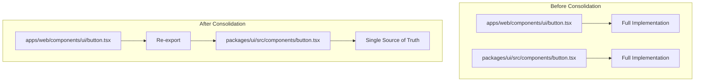

# Design Document: UI Component Consolidation

## Overview

This design describes the approach for consolidating UI components from `apps/web/components/ui` to use the shared `@workspace/ui` package (shadcn-based) while maintaining backward compatibility with existing imports. The `packages/ui` package is configured with shadcn's "new-york" style and serves as the single source of truth for base UI components. The solution uses re-exports to preserve import paths like `@workspace/ui/components/button` while sourcing implementations from the shared package.

## Architecture



### Component Classification

Components are classified into two categories:

1. **Base Components** (candidates for re-export):
   - Exist in both `packages/ui` and `apps/web/components/ui`
   - Generic, reusable UI primitives
   - Examples: button, input, dialog, card, tabs

2. **App-Specific Components** (remain in web app):
   - Only exist in `apps/web/components/ui`
   - Tied to specific app functionality (Plate editor, AI features)
   - Identified by naming patterns: `*-node.tsx`, `*-toolbar-button.tsx`, `ai-*.tsx`

## Components and Interfaces

### Re-export Pattern

For base components, the web app file becomes a simple re-export:

```typescript
// apps/web/components/ui/button.tsx
export { Button, buttonVariants } from '@workspace/ui/components/button';
export type { ButtonProps } from '@workspace/ui/components/button';
```

### Component Mapping

| packages/ui Component | apps/web Component | Action |
|----------------------|-------------------|--------|
| accordion.tsx | accordion.tsx | Re-export |
| alert-dialog.tsx | alert-dialog.tsx | Re-export |
| alert.tsx | alert.tsx | Re-export |
| aspect-ratio.tsx | aspect-ratio.tsx | Re-export |
| avatar.tsx | avatar.tsx | Re-export |
| badge.tsx | badge.tsx | Re-export |
| breadcrumb.tsx | breadcrumb.tsx | Re-export |
| button.tsx | button.tsx | Re-export |
| calendar.tsx | calendar.tsx | Re-export |
| card.tsx | card.tsx | Re-export |
| carousel.tsx | carousel.tsx | Re-export |
| chart.tsx | chart.tsx | Re-export |
| checkbox.tsx | checkbox.tsx | Re-export |
| collapsible.tsx | collapsible.tsx | Re-export |
| command.tsx | command.tsx | Re-export |
| context-menu.tsx | context-menu.tsx | Re-export |
| dialog.tsx | dialog.tsx | Re-export |
| drawer.tsx | drawer.tsx | Re-export |
| dropdown-menu.tsx | dropdown-menu.tsx | Re-export |
| empty.tsx | empty.tsx | Re-export |
| form.tsx | form.tsx | Re-export |
| hover-card.tsx | hover-card.tsx | Re-export |
| input-group.tsx | input-group.tsx | Re-export |
| input-otp.tsx | input-otp.tsx | Re-export |
| input.tsx | input.tsx | Re-export |
| kbd.tsx | kbd.tsx | Re-export |
| label.tsx | label.tsx | Re-export |
| menubar.tsx | menubar.tsx | Re-export |
| navigation-menu.tsx | navigation-menu.tsx | Re-export |
| pagination.tsx | pagination.tsx | Re-export |
| popover.tsx | popover.tsx | Re-export |
| progress.tsx | progress.tsx | Re-export |
| radio-group.tsx | radio-group.tsx | Re-export |
| resizable.tsx | resizable.tsx | Re-export |
| scroll-area.tsx | scroll-area.tsx | Re-export |
| select.tsx | select.tsx | Re-export |
| separator.tsx | separator.tsx | Re-export |
| sheet.tsx | sheet.tsx | Re-export |
| sidebar.tsx | sidebar.tsx | Re-export |
| skeleton.tsx | skeleton.tsx | Re-export |
| slider.tsx | slider.tsx | Re-export |
| sonner.tsx | sonner.tsx | Re-export |
| switch.tsx | switch.tsx | Re-export |
| table.tsx | table.tsx | Re-export |
| tabs.tsx | tabs.tsx | Re-export |
| textarea.tsx | textarea.tsx | Re-export |
| toggle-group.tsx | toggle-group.tsx | Re-export |
| toggle.tsx | toggle.tsx | Re-export |
| tooltip.tsx | tooltip.tsx | Re-export |

### App-Specific Components (No Change)

These components remain in `apps/web/components/ui` with their full implementations:

- All `*-node.tsx` and `*-node-static.tsx` files (Plate editor nodes)
- All `*-toolbar-button.tsx` files (editor toolbar buttons)
- `ai-*.tsx` files (AI-specific components)
- `block-*.tsx` files (editor block components)
- Animation components: `animated-grid-pattern.tsx`, `animated-shiny-text.tsx`, etc.
- Custom components not in shared package: `bento-grid.tsx`, `border-beam.tsx`, etc.

## Data Models

### Component Classification Type

```typescript
interface ComponentClassification {
  name: string;
  path: string;
  category: 'base' | 'app-specific';
  action: 'reexport' | 'keep';
  sharedPackagePath?: string;
}
```

### Export Mapping

```typescript
interface ExportMapping {
  componentName: string;
  originalExports: string[];
  sharedExports: string[];
  missingExports: string[];
}
```

## Correctness Properties

*A property is a characteristic or behavior that should hold true across all valid executions of a system-essentially, a formal statement about what the system should do. Properties serve as the bridge between human-readable specifications and machine-verifiable correctness guarantees.*

### Property Reflection

After analyzing the prework, the following properties were identified as redundant or combinable:
- Properties 2.2 and 2.3 can be combined (both about import resolution)
- Properties 3.1, 3.2, 3.3 can be combined into a single "re-export completeness" property
- Properties 4.1 and 4.3 are essentially the same (app-specific retention)

### Property 1: Component Classification Correctness
*For any* component file in `apps/web/components/ui`, if it exists in `packages/ui/src/components` with the same name, it SHALL be classified as a base component candidate for re-export.
**Validates: Requirements 1.1, 1.2**

### Property 2: App-Specific Pattern Detection
*For any* component file name containing `-node`, `-node-static`, `-toolbar-button`, or prefixed with `ai-`, `block-`, the component SHALL be classified as app-specific and excluded from consolidation.
**Validates: Requirements 1.3**

### Property 3: Re-export Completeness
*For any* consolidated base component, the re-export file SHALL export all symbols that were originally exported, and importing from `@workspace/ui/components/{component}` SHALL resolve to the same exports as `@workspace/ui/components/{component}`.
**Validates: Requirements 2.1, 2.2, 2.3, 3.1, 3.2, 3.3**

### Property 4: App-Specific Component Preservation
*For any* app-specific component, the file SHALL retain its full implementation (not be converted to a re-export) and SHALL continue to function correctly.
**Validates: Requirements 4.1, 4.3**

### Property 5: Export Signature Consistency
*For any* consolidated component, the TypeScript type signatures of all exports SHALL remain compatible with their original signatures.
**Validates: Requirements 5.1**

### Property 6: Utility Function Compatibility
*For any* input to the `cn` utility function, the output from `@workspace/ui/lib/utils` SHALL be identical to the output from `@/lib/utils`.
**Validates: Requirements 6.2**

## Error Handling

1. **Missing Exports**: If the shared package is missing exports that the web app component had, add the missing exports to the shared package before creating the re-export.

2. **Type Mismatches**: If type signatures differ between packages, update the shared package to be a superset of both type definitions.

3. **Dependency Conflicts**: If the shared package lacks required dependencies, add them to `packages/ui/package.json`.

4. **Build Failures**: Run TypeScript compilation after each batch of changes to catch errors early.

## Testing Strategy

### Unit Testing
- Verify each re-export file correctly exports all expected symbols
- Verify app-specific components are not modified
- Verify import paths resolve correctly

### Property-Based Testing
Using a property-based testing library (e.g., fast-check), implement the following:

1. **Classification Property Test**: Generate component names and verify classification rules are applied correctly
2. **Re-export Completeness Test**: For each consolidated component, verify all original exports are available
3. **Utility Compatibility Test**: Generate random class name inputs and verify `cn` produces identical output from both packages

### Integration Testing
- Build the web app and verify no TypeScript errors
- Run existing tests to ensure no regressions
- Manually verify a sample of UI components render correctly

